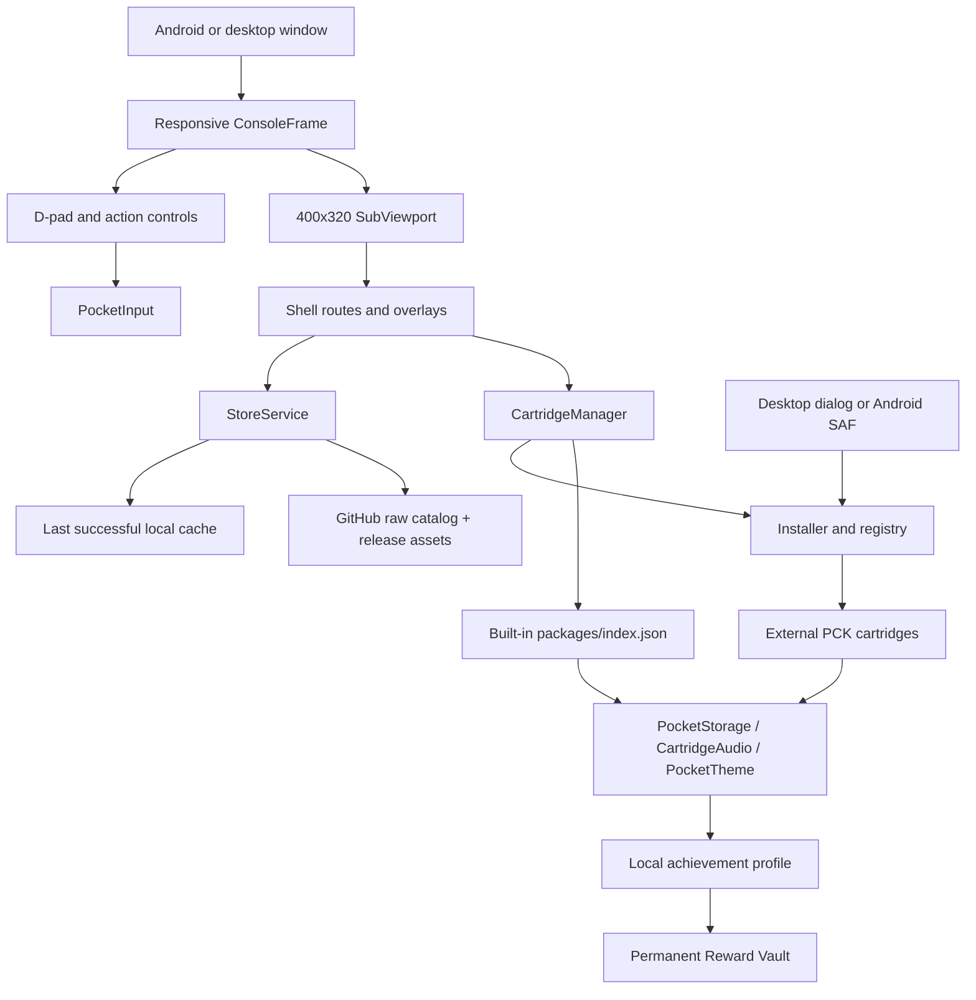

# OpenPocket Architecture

OpenPocket 0.4.0 separates the responsive handheld UI, pixel-perfect content, runtime services, trusted built-ins, static catalog, local profile, and experimental external cartridge pipeline.

## Shell And Display

`app/main.gd` owns routing, the active cartridge, the system overlay, Android Back handling, and package launch. `app/shell/shell_view.gd` provides Home, Library, Store, install, Settings, and About flows. `app/shell/system_menu.gd` provides pause, restart, package settings, Library, Home, and confirmed application exit.

`app/ui/console_frame.gd` fills the available window, applies Android safe-area margins, and lays out the physical controls responsively. Shell and cartridge scenes render into a separate 400x320 `SubViewport` using nearest-neighbor filtering. Integer scaling is limited to the virtual display rather than the whole phone layout.

## Runtime Services

- `PocketInput`: keyboard, gamepad, Android Back, and virtual console input.
- `PocketStorage`: Shell settings and package-scoped settings/data under Godot `user://`.
- `PocketAudio`: Shell-owned UI tones that honor global sound settings.
- `CartridgeAudio`: active-package sound ownership and cleanup.
- `PocketSystem`: notifications, platform context, and confirmed application exit.
- `PocketTheme`: active palette and pixel display constants.
- `PocketRouter`: Shell route and system-menu requests.
- `CartridgeManager`: built-in bootstrap, external registry, verification, mounting, launch preparation, and removal.
- `PocketFilePicker`: desktop file dialog plus Android SAF bridge, both producing an app-owned staging file.
- `StoreService`: filtering, semantic version comparison, and download handoff through a provider.
- `PocketPackages`: compatibility adapter over `CartridgeManager`; retained for older Shell/runtime call sites and considered deprecated for new cartridge code.

## Built-In And External Cartridges

Trusted built-ins are listed in `packages/index.json` and carry both legacy-compatible `manifest.json` and cartridge metadata. Runtime directory scanning is avoided so exported projects have deterministic contents.

External `.pctrg` files contain `cartridge.json` and a real Godot `content.pck`. They install under `user://cartridges/packages/`; registry metadata and app-owned import staging stay under `user://`. Mounted resources use `res://cartridges/<package-id>/` and cannot replace existing resources.

Godot does not provide dependable runtime PCK unloading. Updating or removing a mounted cartridge can therefore require an application restart.

## Storage And Lifecycle

Each package has separate `settings` and `data` namespaces. Settings are resettable preferences. Data holds high scores, statistics, and user-created content. `get_package_value` and `set_package_value` remain compatibility aliases for package data.

Library launch prepares a package through `CartridgeManager`, opens a `CartridgeAudio` scope, then instantiates its entry scene inside the virtual display. MENU opens the Shell overlay. BACK follows package or Shell navigation. Exiting the package ends its audio scope and returns ownership to the Shell.

## Store Provider

OpenPocket 0.4.0 uses `GitHubCatalogProvider` with a static raw HTTPS catalog, ETag/Last-Modified revalidation, request limits, and last-successful cache. `LocalStoreProvider` remains a development fixture. Downloaded release assets are checked against catalog SHA-256 before installer validation. Android INTERNET is used only for catalog and asset GET requests.

## Achievements And Cosmetics

`CartridgeAchievements` binds event/counter/value updates to the active cartridge ID. `AchievementManager` owns versioned atomic profile storage; cartridges cannot select another namespace. Cartridge-provided themes/backgrounds are discovered from installed manifests. Permanent reward assets are copied into `user://profile/cosmetics/` with checksums and metadata, so uninstalling the source cartridge does not break earned rewards. These local records are user-editable and are not anti-cheat evidence.

## Android File Picker

The OpenPocket Android plugin invokes Storage Access Framework. The user selects one `.pctrg`; the plugin copies it to app-owned storage and does not request broad storage access. Desktop builds use Godot `FileDialog` with the same installer handoff.

## Security Boundary

Built-ins are trusted because they ship with the source and application. External GDScript executes in the OpenPocket process and is not sandboxed. Developer Mode is an explicit risk gate, not isolation. Checksums validate expected bytes, not publisher identity. Capability declarations are not a process-level permission boundary.

Future work may add signed manifests, trust roots, permissions, storage quotas, and an isolated scripting runtime such as constrained Lua or WebAssembly. None of those controls are implemented in 0.4.0.
