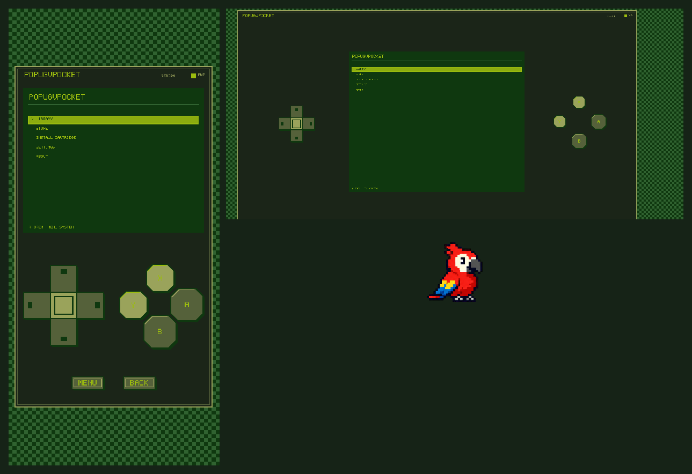
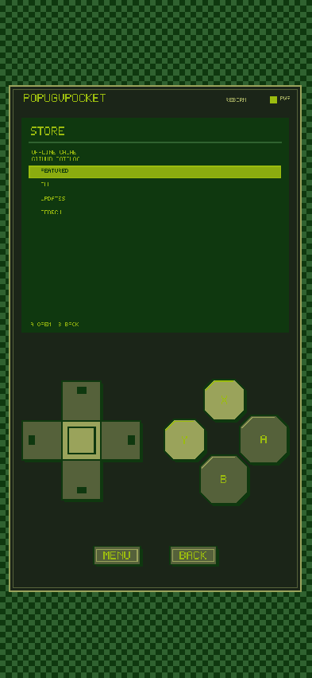

# PopugVPocket



PopugVPocket is an experimental pixel handheld platform for Android with installable `.pctrg` apps and games. Version **0.5.1** stabilizes the VGirl landscape profile, the cartridge lifecycle, and Android release tooling after Reborn.

## Highlights

- Pixel-perfect 400x320 PocketScreen separated from responsive physical controls.
- Controller-first Shell, Android Back handling, D-pad/stick profiles, and multitouch action buttons.
- Built-in apps and games plus experimental format-v2 external cartridges.
- HTTPS catalog cache, SHA-256 verification, atomic download staging, install, update, repair, reinstall, and uninstall.
- Local achievements, permanent rewards, themes, backgrounds, and package-scoped storage.

## VBoy and VGirl

VBoy is the portrait layout. VGirl is a landscape console with directions in the left thumb zone, PocketScreen in the center, and XYAB in the right thumb zone. External layout scales independently from PocketScreen; bitmap content keeps nearest filtering and integer display scale whenever the window allows it.

## Cartridge Store

Store reads the approved static catalog from [Creep7er/openpocket-catalog](https://github.com/Creep7er/openpocket-catalog), caches the last valid response, and verifies release size and SHA-256 before installation. The current public catalog does not yet contain published external `.pctrg` release assets, so production remote installation remains unverified. Local fixtures cover Pixel Clock and Pocket Dice end to end.

## Built-in cartridges

- Snake
- Pocket Pong
- Pocket Breakout
- Pocket Notes

## Achievements and rewards

Cartridges report progress through `CartridgeAchievements`. Achievement data is local and editable. Permanent rewards are copied into the reward vault; catalog moderation is not anti-cheat or a security boundary.

## Customization

The Shell supports VBoy/VGirl profiles, D-pad or stick controls, Mono/Amber and cartridge-provided themes, backgrounds, scanlines, audio volume, and optional debug geometry.

## Screenshots

| VBoy | VGirl | Store |
|---|---|---|
|  |  |  |

## Install on Android

Download the compact APK from GitHub Releases when an artifact is published, or build locally using [docs/android-build.md](docs/android-build.md). Package id: `org.popugonet.popugvpocket`; versionCode: `7`.

## Build from source

Requirements: Godot 4.7, matching export templates, Python 3.10+, JDK 17, and Android SDK 36.

```powershell
python tools/validate_project.py
godot --headless --editor --path . --quit
powershell -ExecutionPolicy Bypass -File tools/build_android_debug.ps1 `
  -Preset "Android Compact Debug" `
  -Output exports/android/popugvpocket-0.5.1-compact-debug.apk
```

## Create a cartridge

Use the [game template](https://github.com/Creep7er/openpocket-game-template) or [app template](https://github.com/Creep7er/openpocket-app-template). Cartridge code uses Pocket APIs rather than Shell internals.

## Publish a cartridge

Tag a template repository to build `.pctrg`, SHA-256, and `catalog-entry.json`. Publish the release asset, verify the generated URL, then open a pull request against the catalog. Catalog main is never changed automatically by a cartridge workflow.

## Repository ecosystem

- Runtime: [Creep7er/OpenPocket](https://github.com/Creep7er/OpenPocket)
- Catalog: [Creep7er/openpocket-catalog](https://github.com/Creep7er/openpocket-catalog)
- Game template: [Creep7er/openpocket-game-template](https://github.com/Creep7er/openpocket-game-template)
- App template: [Creep7er/openpocket-app-template](https://github.com/Creep7er/openpocket-app-template)

These are the repositories' current names; no rename is implied.

## Security model

External Godot PCK code runs inside the application process and is **not sandboxed**. HTTPS and checksums detect transport corruption or unexpected bytes; they do not establish publisher identity. Read [SECURITY.md](SECURITY.md).

## Current limitations

- No production signing key is stored in the repository.
- No external release asset is currently approved in the public catalog.
- Android 0.5.1 still requires verification on a connected physical device.
- Mounted PCK updates can require an application restart.

## Roadmap

See [ROADMAP.md](ROADMAP.md).

## Contributing

See [CONTRIBUTING.md](CONTRIBUTING.md) and [AGENTS.md](AGENTS.md).

## License

MIT. Third-party notices are listed in [THIRD_PARTY.md](THIRD_PARTY.md).
