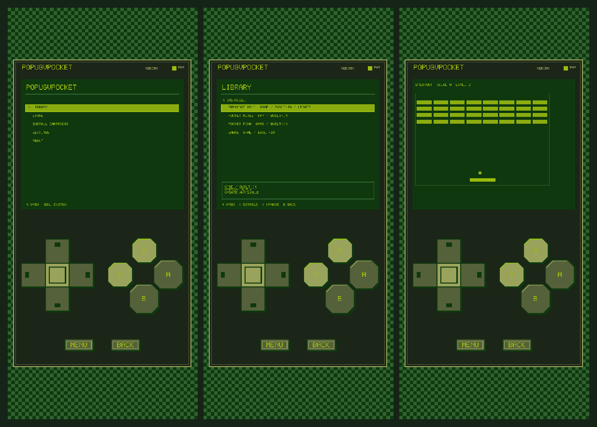
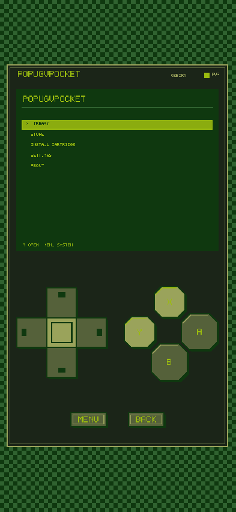
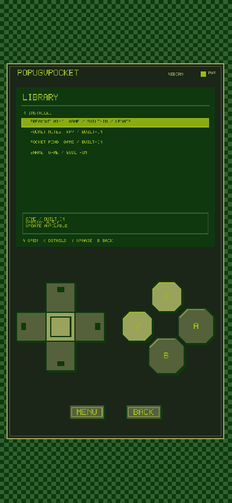
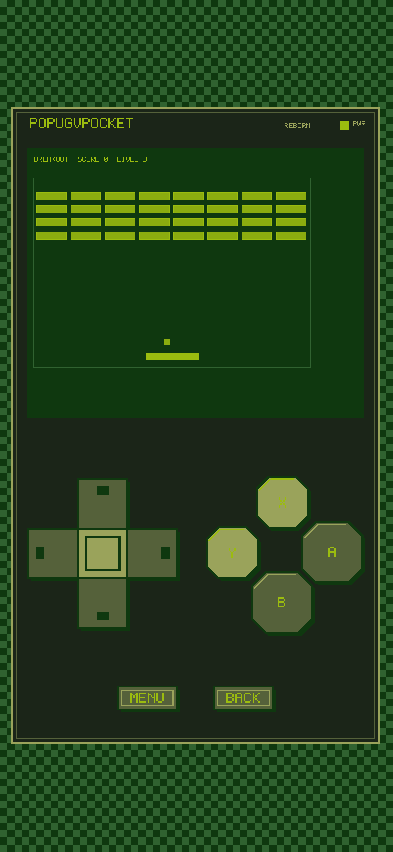
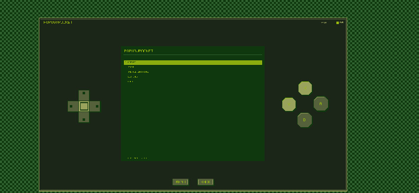
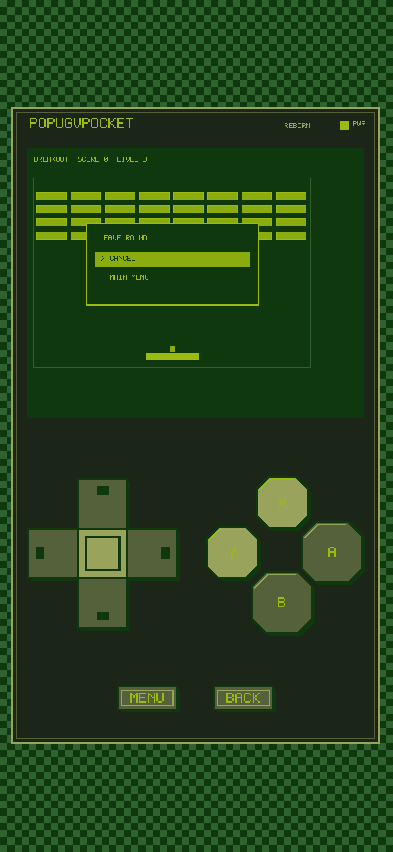
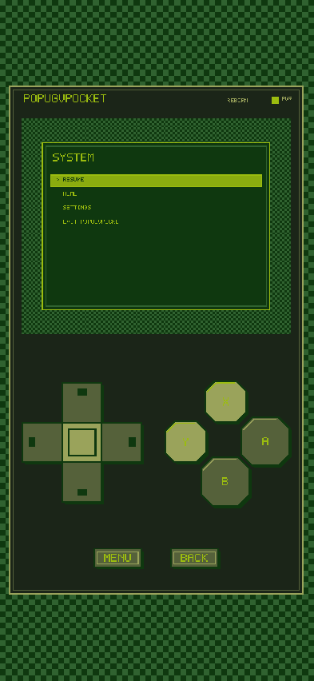

# PopugVPocket

PopugVPocket is an open-source pixel-art virtual handheld built with Godot 4.7. It combines an Android-first console shell, trusted built-in apps and games, and an experimental installable cartridge format.

**Project status:** Experimental / Alpha

**Current version:** 0.5.0 Reborn development branch

**First public source snapshot:** 0.3.2



## What Is PopugVPocket?

PopugVPocket presents a responsive handheld body around a pixel-perfect 400x320 virtual screen. The outer controls adapt to portrait phone screens, while Shell and cartridge content remain sharp and controller-driven.

PopugVPocket 0.5.0 is a clean rebirth of OpenPocket. It intentionally resets application and cartridge compatibility, adds VBoy and VGirl physical profiles, configurable D-pad/stick controls, the V-Parrot mascot, and Cartridge Format v2. External cartridges can still execute Godot code in the application process.

## Highlights

- VBoy portrait and VGirl landscape layouts around the same pixel-perfect 400x320 screen; VGirl places directions left and actions right of the display.
- Pixel D-pad or fixed/floating virtual stick, A/B/X/Y buttons, MENU, and BACK controls.
- Keyboard, gamepad, touch, and Android Back integration through `PocketInput`.
- Package-scoped settings, save data, and cartridge audio ownership.
- `.pctrg` installation, inspection, checksum verification, update, and uninstall flows.
- Android Storage Access Framework picker without broad storage permissions.
- GitHub-hosted curated Store catalog with last-successful offline cache.
- Local cartridge achievements and persistent Reward Vault cosmetics.
- Experimental game/app SDK templates and cartridge builder.

## Screenshots

| Home | Library | Store |
| --- | --- | --- |
|  |  |  |

| Breakout | Install warning |
| --- | --- |
|  |  |

| VGirl landscape | Breakout dialog | System menu |
| --- | --- | --- |
|  |  |  |

## Built-In Cartridges

- **Snake:** Classic and Time Attack modes, configurable rules, high scores, and statistics.
- **Pocket Pong:** Player vs CPU with configurable difficulty, target score, and match settings.
- **Pocket Notes:** Short local notes edited with an on-screen pixel keyboard.
- **Breakout Mini:** Reworked brick breaker with settings, statistics, lives, and reliable stepped collision handling.

The repository also contains source and local Store fixtures for Pocket Dice and Pixel Clock. They are examples, not remotely distributed packages.

## Cartridge System

A `.pctrg` file is a ZIP container using PopugVPocket Cartridge Format v2 with `cartridge.json`, `content.pck`, and optional metadata such as `README.md`, `LICENSE`, and `icon.png`. Format v1 cartridges are rejected. Built-in cartridges are trusted project source. External cartridges are installed into app-owned storage and may execute unsandboxed GDScript.

**Library** lists cartridges currently available to launch. **Store** refreshes the public static [popugvpocket-catalog](https://github.com/Creep7er/popugvpocket-catalog) over HTTPS and falls back to its last successful cache. Release assets are checksum-verified; the local provider remains a development fixture.

Achievements and earned rewards stay on the device. Cartridge-provided cosmetics require their source cartridge; permanent rewards are copied into an independent Reward Vault and survive uninstall.

## Install A Cartridge

1. Open **Install Cartridge** from Home.
2. Select a `.pctrg` with Android Files or the desktop file dialog.
3. Review its identity, capabilities, and warning.
4. Enable Developer Mode for manually imported external code.
5. Confirm installation only when the source is trusted.

Checksums detect corruption. They do not prove publisher identity. See [SECURITY.md](SECURITY.md).

## Controls

| Console | Keyboard |
| --- | --- |
| D-pad | Arrow keys or WASD |
| A | Z |
| B | X |
| X | A |
| Y | S |
| MENU | Enter |
| BACK | Escape |

## Android Builds

The Android package id is `org.popugonet.popugvpocket`; version 0.5.0 uses `versionCode` 6. INTERNET is enabled for Store catalog/assets; the SAF picker still avoids broad storage permissions.

The compact preset keeps arm64 and the SAF plugin while compressing the native Godot library. Production signing is not configured.

## Quick Start For Development

Requirements:

- Godot 4.7 stable without .NET.
- Python 3.10 or newer.
- Git.

```powershell
git clone https://github.com/Creep7er/PopugVPocket.git
cd PopugVPocket
godot --path .
```

Validate the source tree:

```powershell
python tools/validate_project.py
godot --headless --path . --editor --quit
godot --headless --path . res://tools/smoke_runner.tscn
```

The executable may be named `godot`, `godot4`, or a platform-specific Godot 4.7 binary.

## Build From Source

Desktop development only needs Godot. Android export additionally needs JDK 17, Android SDK platform 36, build-tools 35.0.1, Godot 4.7 export templates, and the included Android plugin build.

```powershell
powershell -ExecutionPolicy Bypass -File .\tools\build_android_debug.ps1 `
  -Godot path\to\godot.exe `
  -JavaHome path\to\jdk `
  -AndroidHome path\to\android-sdk `
  -Preset "Android Compact Debug" `
  -Output exports\android\popugvpocket-0.5.0-compact-debug.apk
```

See [docs/android-build.md](docs/android-build.md) for setup details.

## Create A Cartridge

Start with `sdk/templates/cartridge-game` or `sdk/templates/cartridge-app`, then update both manifests and use only the public Pocket services.

```powershell
python tools/cartridge_builder.py build path\to\cartridge
python tools/cartridge_builder.py validate dist\cartridges\your.cartridge-0.1.0.pctrg
```

Guides live in [docs/cartridges](docs/cartridges/overview.md) and [sdk/docs](sdk/docs/creating-a-game.md). Standalone templates are also available in [popugvpocket-app-template](https://github.com/Creep7er/popugvpocket-app-template) and [popugvpocket-game-template](https://github.com/Creep7er/popugvpocket-game-template).

## Repository Structure

```text
app/          Runtime, Shell, responsive console UI
packages/     Trusted built-in cartridges
cartridges/   Source for external cartridge examples
store/        Local mock catalog and package fixtures
sdk/          Experimental API docs, schemas, and templates
docs/         Architecture, Android, cartridge, and release docs
tools/        Validators, builders, smoke tests, and capture tools
android/      PopugVPocket Android plugin source and AAR
.github/      Issue templates and CI workflows
```

## Current Limitations

- External Godot code is not sandboxed or digitally signed.
- Developer Mode changes install policy; it does not make code safe.
- Catalog inclusion and SHA-256 validation do not sandbox external cartridge code.
- Achievements are local statistics, not an anti-cheat system.
- Mounted PCK files cannot be reliably unloaded, so some updates require restart.
- The cartridge API is experimental and has no long-term compatibility guarantee yet.
- Old Android app data is not automatically readable under the new package id. Developer Mode exposes a manual safe-data legacy backup importer.
- AAB production signing and broad real-device coverage are not complete.

## Roadmap

See [ROADMAP.md](ROADMAP.md). The next priorities are cartridge signatures, publisher keys, stronger capability enforcement, SDK stabilization, and broader Android testing.

## Privacy

PopugVPocket has no accounts, analytics, telemetry, or cloud achievement sync. Store refresh performs ordinary GET requests to GitHub; installed cartridge comparison happens locally and the installed list is not uploaded. See [docs/PRIVACY.md](docs/PRIVACY.md).

## Contributing

Read [CONTRIBUTING.md](CONTRIBUTING.md), [ARCHITECTURE.md](ARCHITECTURE.md), and [AGENTS.md](AGENTS.md) before changing runtime or cartridge behavior.

A concise Russian overview is available at [docs/README.ru.md](docs/README.ru.md).

## License

PopugVPocket is licensed under the [MIT License](LICENSE). Third-party and project-authored asset notices are listed in [THIRD_PARTY.md](THIRD_PARTY.md).
