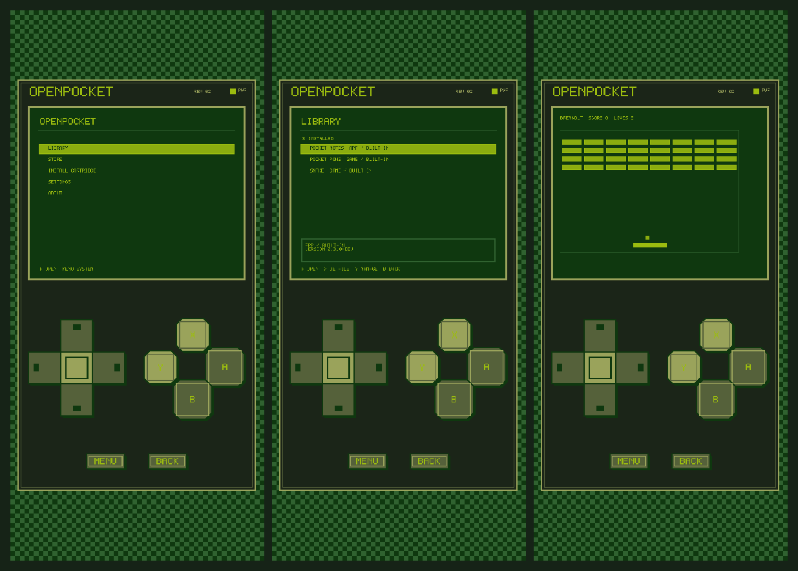

# OpenPocket 0.3.2

OpenPocket 0.3.2 is the first public source snapshot of the experimental Godot virtual handheld. Earlier versions were private development milestones summarized in `CHANGELOG.md`; their Git history is not part of the public snapshot.

## Highlights

- Cleaner Home, Library, Store, Settings, install, and system-menu flows.
- Correct Store filters, Search, Updates, and semantic version handling.
- Rebuilt Breakout gameplay loop and scoped cartridge audio ownership.
- Responsive Android-first console around a pixel-perfect 400x320 display.
- Compact debug APK and unsigned AAB export presets.

## Screenshots

Additional runtime captures are available in [`docs/screenshots`](../screenshots/).

## Install Notes

APK download will be attached to the GitHub release after the public repository and release are created. The Android package id is `org.openpocket.app`, `versionName` is `0.3.2`, and `versionCode` is `5`.

The compact debug APK is intended for direct testing. The AAB preset is unsigned and requires a production key before store submission.

## Cartridge Warning

External cartridges can execute Godot code inside the application process. OpenPocket 0.3.2 does not sandbox or digitally sign that code. Install external `.pctrg` files only from trusted sources.

## Known Limitations

- Store data and downloads are repository-local mock content.
- Mounted PCK updates can require application restart.
- The SDK and compatibility policy remain experimental.
- Production signing and broad physical-device verification are incomplete.

## Checks Performed

- Python project validator and JSON validation.
- Godot 4.7 headless import and main-scene smoke test.
- Store filter, Breakout gameplay, and audio ownership tests.
- Public staging scan for secrets, local paths, binaries, missing links, and required source files.
